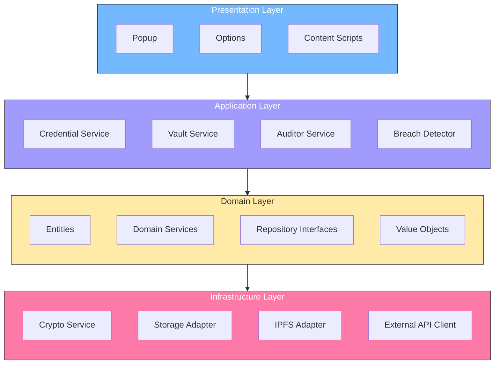

# 📊 Diagrama 02: Arquitectura de Capas



## Regla de Dependencia

```
┌─────────────────────────────────────────────────────────────┐
│                    DEPENDENCY RULE                           │
├─────────────────────────────────────────────────────────────┤
│                                                              │
│   PRESENTATION ──────────────────────────────────────────►   │
│       │                                                      │
│       │ Depende de                                          │
│       ▼                                                      │
│   APPLICATION ──────────────────────────────────────────►    │
│       │                                                      │
│       │ Depende de interfaces, NO implementaciones           │
│       ▼                                                      │
│   DOMAIN ──────────────────────────────────────────────►     │
│       │                                                      │
│       │ Define interfaces, NO depende de nada                │
│       ▼                                                      │
│   INFRASTRUCTURE ◄────────────────────────────────────────  │
│       │                                                      │
│       │ Implementa las interfaces del dominio              │
│       │                                                      │
└─────────────────────────────────────────────────────────────┘
```

## Detalle por Capa

### Presentation Layer
- No contiene lógica de negocio
- Solo maneja UI y eventos
- Usa servicios de Application Layer

### Application Layer
- Orquestra casos de uso
- No tiene estado
- Usa entidades del Domain Layer

### Domain Layer
- Contiene la lógica de negocio pura
- No tiene dependencias externas
- Define interfaces para infrastructure

### Infrastructure Layer
- Implementa las interfaces definidas
- Maneja detalles técnicos
- Conecta con recursos externos

---

*Volver a [README.md](README.md)*
