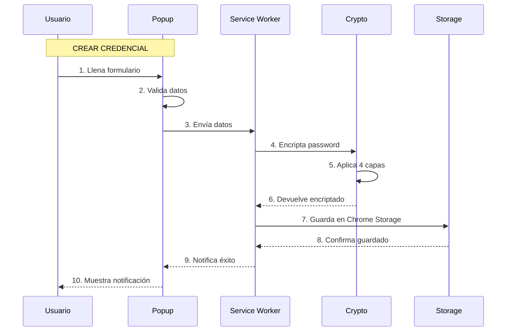
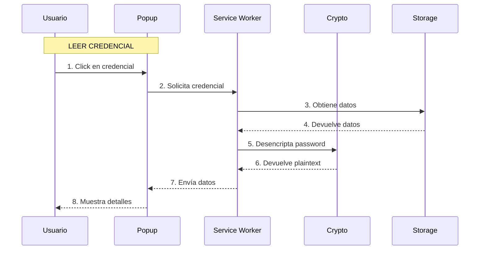
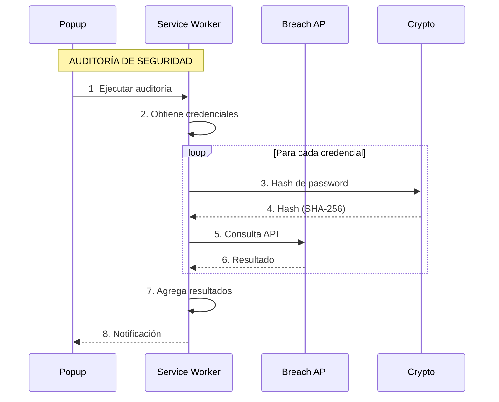

# 📊 Diagrama 03: Flujo de Datos

```mermaid
sequenceDiagram
    participant U as Usuario
    participant P as Popup
    participant S as Service Worker
    participant C as Crypto
    participant St as Storage

    Note over U,P: CREAR CREDENCIAL
    U->>P: 1. Llena formulario
    P->>P: 2. Valida datos
    P->>S: 3. Envía datos
    S->>C: 4. Encripta password
    C->>C: 5. Aplica 4 capas
    C-->>S: 6. Devuelve encriptado
    S->>St: 7. Guarda en Chrome Storage
    St-->>S: 8. Confirma guardado
    S-->>P: 9. Notifica éxito
    P-->>U: 10. Muestra notificación
```

```mermaid
sequenceDiagram
    participant U as Usuario
    participant P as Popup
    participant S as Service Worker
    participant C as Crypto
    participant St as Storage

    Note over U,P: LEER CREDENCIAL
    U->>P: 1. Click en credencial
    P->>S: 2. Solicita credencial
    S->>St: 3. Obtiene datos
    St-->>S: 4. Devuelve datos
    S->>C: 5. Desencripta password
    C-->>S: 6. Devuelve plaintext
    S-->>P: 7. Envía datos
    P-->>U: 8. Muestra detalles
```

```mermaid
sequenceDiagram
    participant P as Popup
    participant S as Service Worker
    participant B as Breach API
    participant C as Crypto

    Note over P,S: AUDITORÍA DE SEGURIDAD
    P->>S: 1. Ejecutar auditoría
    S->>S: 2. Obtiene credenciales
    loop Para cada credencial
        S->>C: 3. Hash de password
        C-->>S: 4. Hash (SHA-256)
        S->>B: 5. Consulta API
        B-->>S: 6. Resultado
    end
    S->>S: 7. Agrega resultados
    S-->>P: 8. Notificación
```

---

*Volver a [README.md](README.md)*
