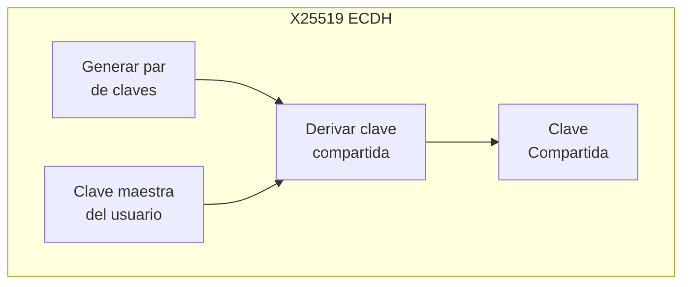
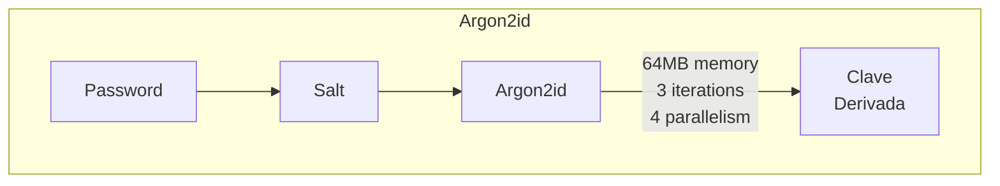
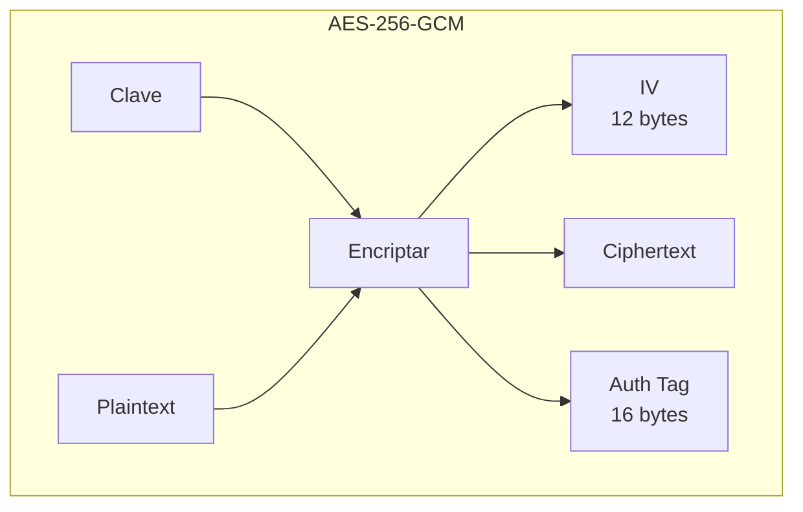
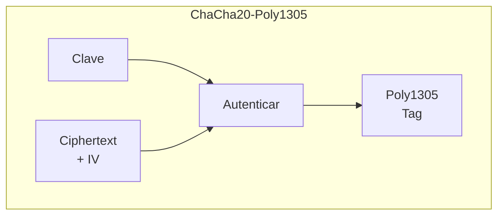

# 📊 Diagrama 04: Sistema de Criptografía

```mermaid
flowchart LR
    subgraph ENCRYPT["ENCRIPTAR"]
        P[Plaintext] --> L1
        L1[X25519<br/>Key Exchange] --> L2
        L2[Argon2id<br/>KDF] --> L3
        L3[AES-256-GCM<br/>Encryption] --> L4
        L4[ChaCha20-Poly1305<br/>Authentication] --> E[Encrypted]
    end

    subgraph DECRYPT["DESENCRIPTAR"]
        E --> DL4
        DL4[ChaCha20<br/>Verify] --> DL3
        DL3[AES-256-GCM<br/>Decrypt] --> DL2
        DL2[Argon2id<br/>Derive Key] --> DL1
        DL1[X25519<br/>Key Exchange] --> P2[Plaintext]
    end

    style L1 fill:#ff6b6b,stroke:#333,color:#fff
    style L2 fill:#feca57,stroke:#333,color:#333
    style L3 fill:#48dbfb,stroke:#333,color:#fff
    style L4 fill:#1dd1a1,stroke:#333,color:#fff
```

## Detalle de Cada Capa

### Capa 1: X25519 (Key Exchange)

### Capa 2: Argon2id (KDF)

### Capa 3: AES-256-GCM

### Capa 4: ChaCha20-Poly1305

---

*Volver a [README.md](README.md)*
