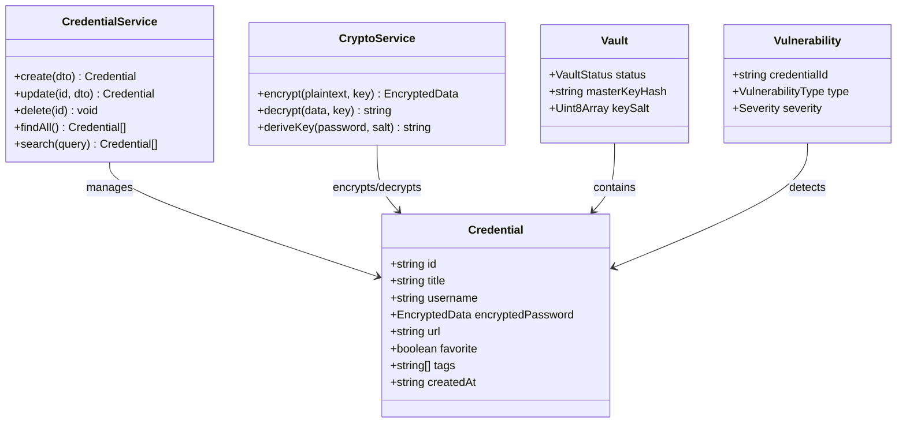
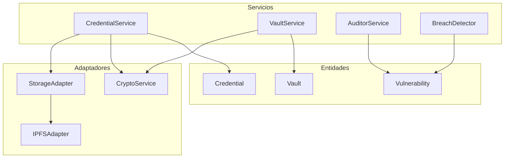

# 📊 Diagrama 05: Componentes

```mermaid
classDiagram
    class Credential {
        +string id
        +string title
        +string username
        +EncryptedData encryptedPassword
        +string url
        +boolean favorite
        +string[] tags
        +string createdAt
    }

    class Vault {
        +VaultStatus status
        +string masterKeyHash
        +Uint8Array keySalt
    }

    class Vulnerability {
        +string credentialId
        +VulnerabilityType type
        +Severity severity
    }

    class CredentialService {
        +create(dto) Credential
        +update(id, dto) Credential
        +delete(id) void
        +findAll() Credential[]
        +search(query) Credential[]
    }

    class CryptoService {
        +encrypt(plaintext, key) EncryptedData
        +decrypt(data, key) string
        +deriveKey(password, salt) string
    }

    CredentialService --> Credential : manages
    CryptoService --> Credential : encrypts/decrypts
    Vault --> Credential : contains
    Vulnerability --> Credential : detects
```

## Relaciones de Componentes

```mermaid
flowchart TB
    subgraph SERVICES["Servicios"]
        CRED[CredentialService]
        VAULT[VaultService]
        AUDIT[AuditorService]
        BREACH[BreachDetector]
    end

    subgraph ENTITIES["Entidades"]
        CRE[Credential]
        VUL[Vulnerability]
        VAU[Vault]
    end

    subgraph ADAPTERS["Adaptadores"]
        CRYPTO[CryptoService]
        STORAGE[StorageAdapter]
        IPFS[IPFSAdapter]
    end

    CRED --> CRE
    VAULT --> VAU
    AUDIT --> VUL
    BREACH --> VUL

    CRED --> CRYPTO
    CRED --> STORAGE
    VAULT --> CRYPTO

    STORAGE --> IPFS
```

---

*Volver a [README.md](README.md)*
