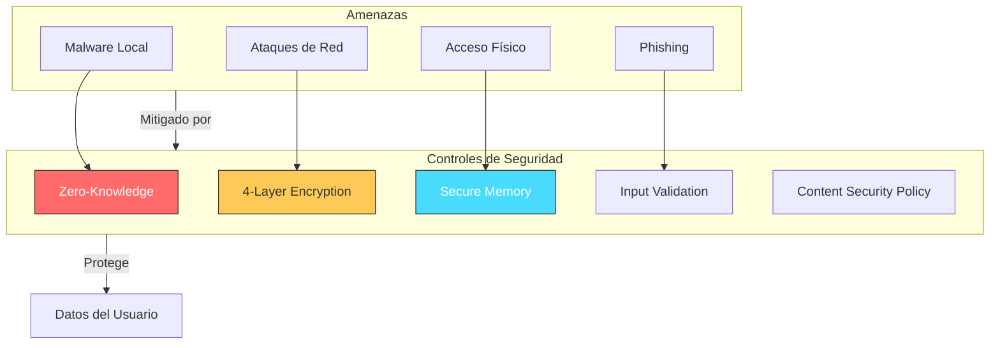
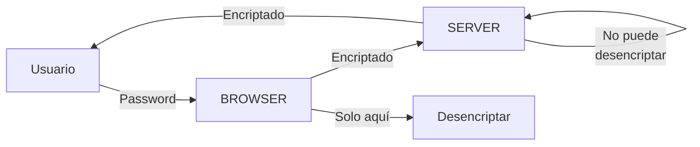
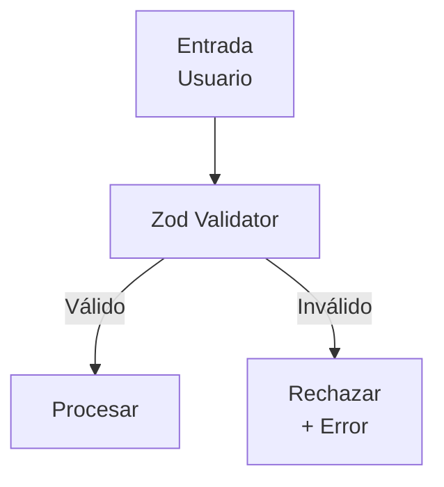

# 📊 Diagrama 06: Modelo de Seguridad



## Controles de Seguridad

### Zero-Knowledge



### Content Security Policy

```
┌─────────────────────────────────────────────────────┐
│              CSP Configuration                        │
├─────────────────────────────────────────────────────┤
│  default-src 'self'                                 │
│  script-src 'self'                                  │
│  style-src 'self' 'unsafe-inline'                   │
│  img-src 'self' data:                               │
│  connect-src 'self' https://api.pwnedpasswords.com │
│  object-src 'none'                                  │
│  base-uri 'self'                                    │
│  form-action 'self'                                 │
└─────────────────────────────────────────────────────┘
```

### Validación de Entrada



---

*Volver a [README.md](README.md)*
