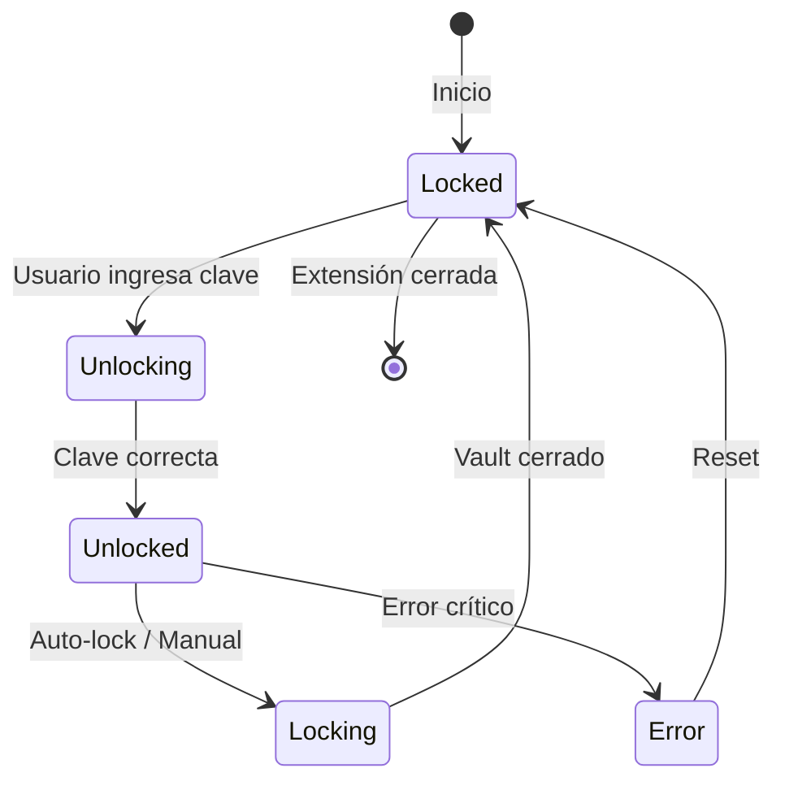
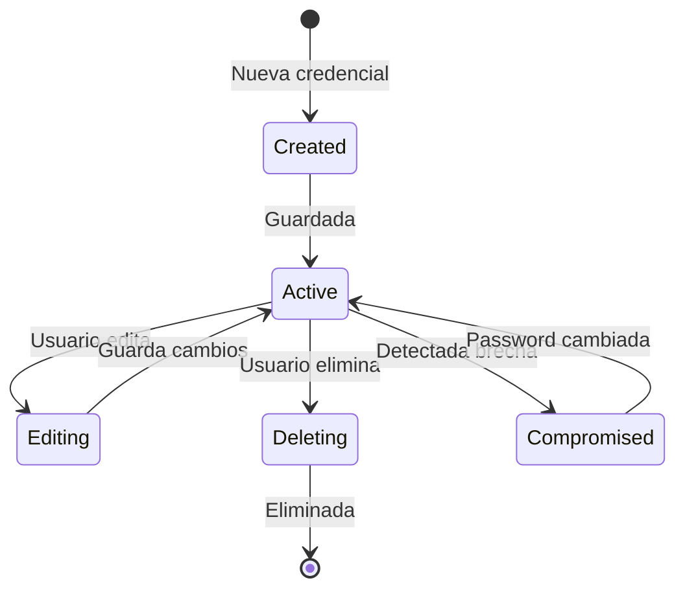
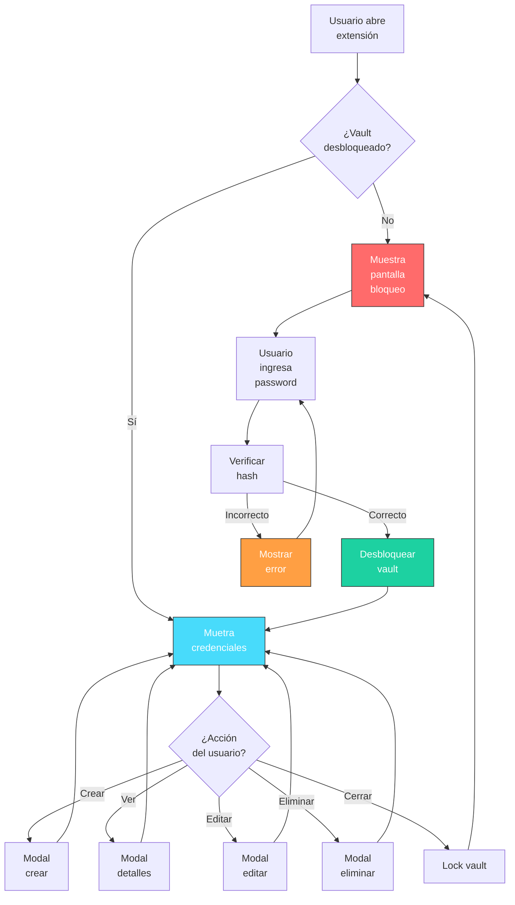

# 📊 Diagrama 07: Máquina de Estados

## Estados del Vault

```mermaid
stateDiagram-v2
    [*] --> Locked: Inicio
    Locked --> Unlocking: Usuario ingresa clave
    Unlocking --> Unlocked: Clave correcta
    Unlocked --> Locking: Auto-lock / Manual
    Locking --> Locked: Vault cerrado
    Unlocked --> Error: Error crítico
    Error --> Locked: Reset
    Locked --> [*]: Extensión cerrada
```

## Estados de Credencial

```mermaid
stateDiagram-v2
    [*] --> Created: Nueva credencial
    Created --> Active: Guardada
    Active --> Editing: Usuario edita
    Editing --> Active: Guarda cambios
    Active --> Deleting: Usuario elimina
    Deleting --> [*]: Eliminada
    Active --> Compromised: Detectada brecha
    Compromised --> Active: Password cambiada
```

## Flujo de Autenticación

```mermaid
flowchart TB
    START[Usuario abre<br/>extensión] --> CHECK{¿Vault<br/>desbloqueado?}
    
    CHECK -->|No| LOCKED[Muestra<br/>pantalla<br/>bloqueo]
    CHECK -->|Sí| SHOW[Muetra<br/>credenciales]
    
    LOCKED --> INPUT[Usuario<br/>ingresa<br/>password]
    INPUT --> VERIFY[Verificar<br/>hash]
    
    VERIFY -->|Correcto| UNLOCK[Desbloquear<br/>vault]
    VERIFY -->|Incorrecto| ERROR[Mostrar<br/>error]
    ERROR --> INPUT
    
    UNLOCK --> SHOW
    
    SHOW --> ACTION{¿Acción<br/>del usuario?}
    
    ACTION -->|Crear| CREATE[Modal<br/>crear]
    ACTION -->|Ver| VIEW[Modal<br/>detalles]
    ACTION -->|Editar| EDIT[Modal<br/>editar]
    ACTION -->|Eliminar| DELETE[Modal<br/>eliminar]
    ACTION -->|Cerrar| LOCK[Lock vault]
    
    CREATE --> SHOW
    VIEW --> SHOW
    EDIT --> SHOW
    DELETE --> SHOW
    LOCK --> LOCKED
    
    style LOCKED fill:#ff6b6b,stroke:#333,color:#fff
    style UNLOCK fill:#1dd1a1,stroke:#333,color:#fff
    style SHOW fill:#48dbfb,stroke:#333,color:#fff
    style ERROR fill:#ff9f43,stroke:#333,color:#fff
```

---

*Volver a [README.md](README.md)*
